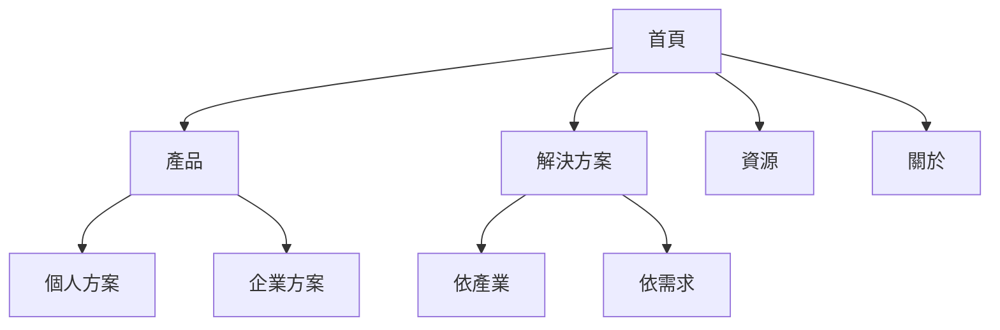

# 資訊架構設計法則

## 核心價值

資訊架構定義內容的組織邏輯與導航路徑,讓使用者能直覺地找到所需資訊。有效的 IA 不只是分類內容,更要反映使用者的心智模型、任務流程與資訊需求,在複雜度與可用性間取得平衡。

## 適用情境

- 設計新產品或網站的結構時
- 重新組織現有內容時
- 使用者反映難以找到資訊時
- 內容量大且複雜時

## 輸入資訊

- 內容清單或網站頁面清單
- 主要任務流程與使用者需求
- 現有導航與分類問題
- 目標平台與內容規模
- 可用研究方法與驗證方式

## 預期產出

- 內容盤點結果
- 分類與層級架構
- 主導航與次導航建議
- 網站地圖或 IA 草圖
- 驗證任務與改善建議

## 觸發提示

- 使用者提到「資訊架構」、「IA」、「網站地圖」、「導航重組」、「分類」、「卡片分類」
- 任務需要整理大量內容、重做選單或改善找不到資訊的問題
- 任務需要定義網站或產品的整體內容結構

## 複雜情境觸發提示

- 任務涉及大型 B2B 平台、內部後台、文件中心或多模組產品
- 使用者提到不同角色看到不同內容、不同權限或不同導航入口
- 問題包含資訊過載、功能太多、選單過深、命名混亂或跨系統切換
- 團隊需要同時兼顧新手與專家使用者,或同時服務管理者與第一線操作人員

## 先問哪些澄清問題

- 這個產品包含哪些主要模組、內容類型或任務區塊?
- 有哪些角色會使用這個資訊架構?他們看到的內容是否相同?
- 使用者最常執行的高頻任務是什麼?最常找不到的是哪些資訊?
- 現有導航有幾層?是否存在重複命名、內部術語或分類衝突?
- 是否需要依權限、組織層級或流程階段顯示不同資訊?
- 這次 IA 調整的成功標準是什麼?例如搜尋時間更短、任務成功率更高或培訓成本更低

## 可搭配哪些其他 skill

- `user-interview`: 先理解不同角色如何命名與尋找資訊
- `wireframing`: 將 IA 結果轉成具體的頁面與導航骨架
- `usability-testing`: 用 tree testing 或原型驗證新架構是否可用
- `persona-creation`: 區分不同角色的心智模型與資訊需求

## 複雜需求範例

### B2B 管理平台導航重整

- 情境: SaaS 後台包含帳務、權限、報表、整合設定與通知中心,新用戶常找不到功能
- IA 重點: 依任務與角色重整主導航,避免把技術設定與日常操作混在一起

### 後台審核與客服雙系統整合

- 情境: 客服與審核員需要在不同工具切換查詢案件資訊
- IA 重點: 建立一致命名、整合查詢入口、區分案件狀態與處理視角

### 多角色文件中心

- 情境: 企業知識庫同時給業務、客服、法務與管理者使用
- IA 重點: 建立跨角色都能理解的分類,並補上依角色/任務進入的捷徑

## 工作流程

### 1. 內容盤點

**列出所有內容**
```markdown
內容清單範例:
- 首頁
- 產品頁面
  - 產品 A
  - 產品 B
  - 產品 C
- 關於我們
- 部落格
- 聯絡我們
- 常見問題
```

**內容審計表**
```csv
頁面名稱,URL,內容類型,重要性,更新頻率,負責人
首頁,/,landing,高,每月,行銷部
產品列表,/products,listing,高,每週,產品部
```

### 2. 卡片分類

**開放式卡片分類**
- 讓使用者自由分組內容卡片
- 讓使用者為每組命名
- 了解使用者的心智模型

**封閉式卡片分類**
- 提供預設的分類
- 讓使用者將卡片放入分類中
- 驗證現有架構是否合理

**執行步驟**
```markdown
1. 準備內容卡片 (30-50 張)
2. 招募 15-20 位使用者
3. 請使用者將卡片分組
4. 記錄分組結果
5. 分析共同模式
6. 建立架構草案
```

### 3. 建立架構

**層級結構原則**
- 保持層級深度在 3-4 層以內
- 每層不超過 7±2 個項目
- 使用清晰的命名

**架構範例**
```
網站
├── 產品與服務
│   ├── 個人方案
│   ├── 企業方案
│   └── 定價
├── 解決方案
│   ├── 依產業
│   └── 依需求
├── 資源
│   ├── 部落格
│   ├── 案例研究
│   └── 文件
└── 關於
    ├── 公司簡介
    ├── 團隊
    └── 聯絡我們
```

### 4. 創建導航

**主導航設計**
- 放置最重要的 5-7 個項目
- 使用清晰的標籤
- 保持一致性

**次導航設計**
- 提供更細緻的分類
- 顯示當前位置
- 支援快速跳轉

**麵包屑導航**
```
首頁 > 產品與服務 > 企業方案 > 進階版
```

### 5. 繪製網站地圖

**視覺化架構**
```
使用工具:
- Figma / Sketch
- Miro / Mural
- OmniGraffle
- draw.io
```

**網站地圖範例**


### 6. 測試驗證

**樹狀測試 (Tree Testing)**
- 提供純文字的架構
- 給予使用者任務
- 觀察他們如何尋找資訊
- 測量成功率和時間

**任務範例**
```markdown
任務 1: 你想了解企業方案的定價,你會去哪裡找?
任務 2: 你想看其他公司如何使用我們的產品,你會去哪裡?
任務 3: 你想聯絡客服,你會去哪裡?
```

## 最佳實踐

1. **使用者心智模型**: 遵循使用者的心智模型,而非組織內部結構
2. **控制深度**: 保持層級深度在 3-4 層以內
3. **清晰命名**: 使用清晰、一致的標籤命名
4. **多重路徑**: 提供多種尋找資訊的路徑
5. **可擴展性**: 考慮內容的可擴展性
6. **驗證測試**: 使用卡片分類法驗證分類邏輯
7. **持續優化**: 根據使用數據持續優化

## 常見模式

### 1. 依主題分類
```
- 產品
- 服務
- 支援
- 關於
```

### 2. 依使用者類型分類
```
- 個人用戶
- 企業客戶
- 開發者
- 合作夥伴
```

### 3. 依任務分類
```
- 開始使用
- 學習
- 取得支援
- 購買
```

### 4. 混合式分類
```
- 產品 (主題)
- 解決方案 (任務)
- 客戶案例 (內容類型)
- 定價 (任務)
```

## 範例輸出

```markdown
# 電商網站資訊架構

## 主導航
1. 商品分類
2. 優惠活動
3. 品牌故事
4. 客戶服務
5. 會員中心

## 網站地圖

### 1. 商品分類
- 1.1 服飾
  - 1.1.1 男裝
  - 1.1.2 女裝
  - 1.1.3 童裝
- 1.2 鞋類
- 1.3 配件

### 2. 優惠活動
- 2.1 本週特價
- 2.2 新品上市
- 2.3 清倉出清

### 3. 品牌故事
- 3.1 關於我們
- 3.2 永續承諾
- 3.3 媒體報導

### 4. 客戶服務
- 4.1 常見問題
- 4.2 運送資訊
- 4.3 退換貨政策
- 4.4 聯絡我們

### 5. 會員中心
- 5.1 我的訂單
- 5.2 收藏清單
- 5.3 優惠券
- 5.4 帳戶設定

## 導航設計建議
- 使用 Mega Menu 展示商品分類
- 加入搜尋功能支援關鍵字查找
- 提供麵包屑導航
- 在頁尾重複主要連結
```

## 工具推薦

- **卡片分類**: OptimalSort, UserZoom
- **樹狀測試**: Treejack, UserZoom
- **網站地圖**: Figma, Miro, draw.io
- **分析工具**: Google Analytics, Hotjar

## 相關技能

- `wireframing`: 將資訊架構轉化為視覺化線框圖
- `user-interview`: 透過訪談了解使用者如何分類資訊
- `usability-testing`: 測試資訊架構的可用性
